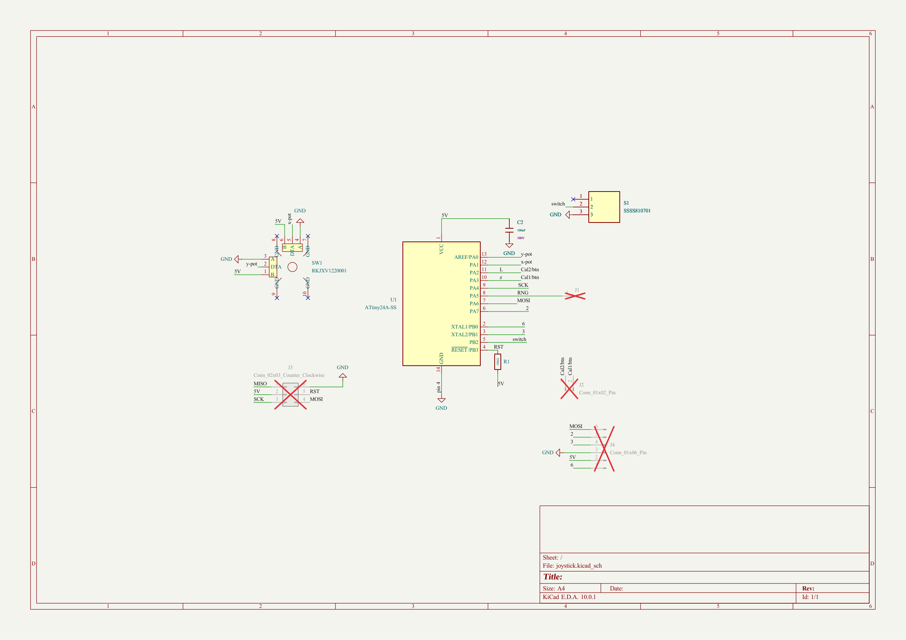
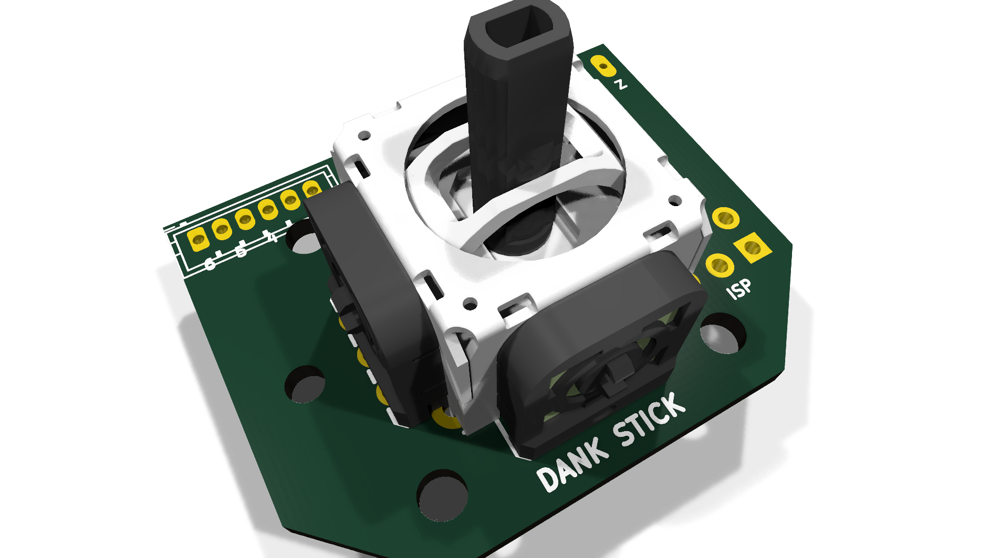
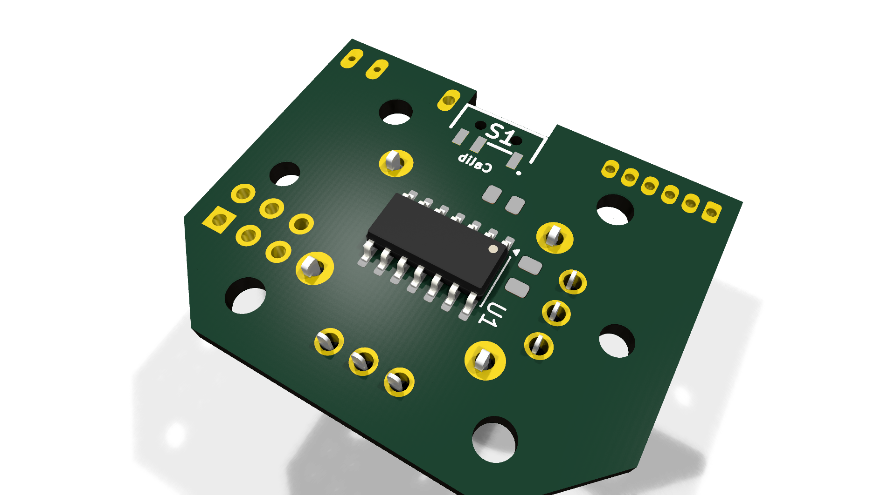

# joystick

Compact ATtiny24A-based USB joystick controller

## At a Glance

- **Status**: Partial / WIP
- **Board size**: 33 x 26.5 mm
- **Layers**: 2
- **Components**: 9
- **Key ICs**:
  - U1: ATtiny24A-SS

## Schematic

Full PDF: [reports/schematic.pdf](reports/schematic.pdf)

## Component Roles

- **ATtiny24A-SS** (U1) - 8-bit AVR MCU; runs V-USB-style soft USB or HID-over-UART
- **RKJXV1220001** (SW1) - Alps thumbstick / encoder (rotary + push button)
- **SSSS810701** (S1) - small slide switch (mode / power)

## PCB

**Top copper**

**Bottom copper**

## Bill of Materials

| Refs | Value | Footprint | Qty | MPN | LCSC |
|------|-------|-----------|----:|-----|------|
| C2 | 100nF | PCM_JLCPCB:C_0805 | 1 |  | [C28233](https://www.lcsc.com/product-detail/_C28233.html) |
| R1 | 10kΩ | PCM_JLCPCB:R_0805 | 1 |  | [C17414](https://www.lcsc.com/product-detail/_C17414.html) |
| S1 | SSSS810701 | SSSS810701 | 1 |  |  |
| SW1 | RKJXV1220001 | joystick:SW-TH_RKJXV1220001 | 1 |  |  |
| U1 | ATtiny24A-SS | Package_SO:SOIC-14_3.9x8.7mm_P1.27mm | 1 |  |  |

_3 of 5 line items don't have an LCSC code in the schematic - search [LCSC](https://www.lcsc.com/) or [JLC parts search](https://jlcsearch.tscircuit.com/) by MPN or footprint when sourcing._

## Files

- `joystick.kicad_pro` - KiCad project
- `joystick.kicad_sch` - schematic source
- `joystick.kicad_pcb` - PCB layout source
- `reports/schematic.pdf` - full schematic (printable)
- `reports/bom.csv` - bill of materials
- `reports/pcb-top.svg`, `reports/pcb-bottom.svg` - copper artwork
- `reports/board-stats.json` - KiCad-generated board statistics

---

_Renders and metadata auto-generated by `Backup-KiCadProject.ps1` using KiCad 10.0._

